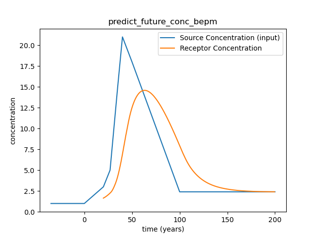
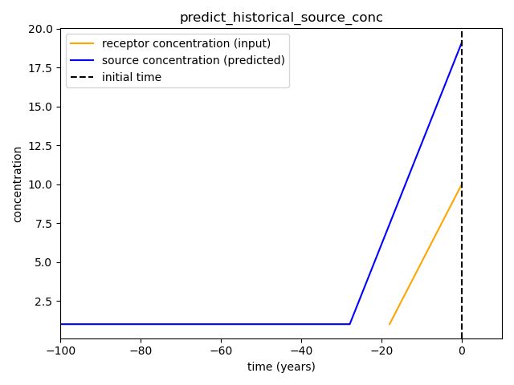

Komanawa Groundwater Age Tools
#######################################

a small repo to hold groundwater age tools developed by Komanawa Solutions Ltd.

.. toctree::
   :maxdepth: 2
   :hidden:

.. contents:: Page Headings
    :depth: 3

Dependencies
==================

* pandas>=2.0.3
* numpy>=1.25.2
* scipy>=1.11.2
* tables>=3.8.0

Installation
==================

This package is currently held as a simple github repo,
but the intention is to make it available on PyPI in the future.

Install from PyPI
------------------
.. todo

coming soon

Install from Github
----------------------

.. code-block:: bash

    pip install git+https://github.com/Komanawa-Solutions-Ltd/komanawa-gw-age-tools

.. code-block:: bash

    conda create -c conda-forge --name gw_detect  python=3.11 pandas=2.0.3 numpy=1.25.2 scipy=1.11.2 pytables=3.8.0
    conda activate gw_detect
    pip install git+https://github.com/Komanawa-Solutions-Ltd/komanawa-gw-age-tools

Usage
==================
Detailed documentation is available in the docstrings of the functions and classes.
The following is a brief overview of the package.

Exponential Piston Flow and Binary Piston flow models
--------------------------------------------------------

key functions:

* exponential_piston_flow_cdf / binary_exp_piston_flow_cdf: calculate the cumulative distribution function for the exponential piston flow model
* exponential_piston_flow / binary_exp_piston_flow: calculate the probability density function for the exponential piston flow model
* check_age_inputs: check the inputs to the binary exponential piston flow model (convince function)

make_age_dist function
^^^^^^^^^^^^^^^^^^^^^^^^

make_age_dist is a convenience function that uses the binary exponential piston flow model to calculate the age distribution and age fraction of water in a groundwater system.

.. code-block:: python

    mrt = 15 # mean residence time
    mrt_p1 = 10 # mean residence time of the first piston
    mrt_p2 = None # will be calculated from mrt and mrt_p1
    frac_p1 = 0.5 # fraction of the flow that is in the first piston
    precision = 2  # the precision of the age distribution (0.01 years per age step)
    f_p1 = 0.7 # fraction of the flow in the first piston which is exponential
    f_p2 = 0.7 # fraction of the flow in the second piston which is exponential

    mrt, mrt_p2 = check_age_inputs(mrt, mrt_p1, mrt_p2, frac_p1, precision, f_p1, f_p2)
    age_step, ages, age_fractions = make_age_dist(mrt, mrt_p1, mrt_p2, frac_p1, precision, f_p1, f_p2, start=np.nan)

    # ages are the age of water in years (from 0 to historical)
    # age_fractions are the fractions of water in each age step (from 0 to historical)
    # age_step is the age step in years (0.01 years in this case)

Source and Receptor analysis tools
--------------------------------------------------------

predict_source_future_past_conc_bepm
^^^^^^^^^^^^^^^^^^^^^^^^^^^^^^^^^^^^^^^^^^^^^^^^

.. code-block:: python

    mrt = 20
    mrt_p1 = 10
    frac_p1 = 0.7
    f_p1 = 0.8
    f_p2 = 0.75
    initial_conc = 10
    prev_slope = 0.5
    max_conc = 20
    min_conc = 1.
    age_range = (-20, 50)
    fut_slope = -0.1
    total_source_conc, receptor_conc = predict_source_future_past_conc_bepm(initial_conc, mrt, mrt_p1, frac_p1, f_p1,
                                                                            f_p2,
                                                                            prev_slope, fut_slope, age_range,
                                                                            max_conc, min_conc, max_fut_conc=20,
                                                                            min_fut_conc=1)
    import matplotlib.pyplot as plt
    fig, ax = plt.subplots()
    ax.plot(total_source_conc.index, total_source_conc.values, label='source_conc', color='b')
    ax.plot(receptor_conc.index, receptor_conc.values, label='receptor_conc', color='r')
    ax.axvline(0, color='k', ls='--', label='initial time')
    ax.set_xlabel('time (years)')
    ax.set_ylabel('concentration')
    ax.set_title('predict_source_future_past_conc_bepm')
    ax.set_xlim(age_range)
    ax.legend()
    fig.tight_layout()
    plt.show()

.. figure:: ../figures/predict_source_future_past_conc_bepm.png
    :height: 500 px
    :align: center

predict_future_conc_bepm
^^^^^^^^^^^^^^^^^^^^^^^^^^^^^^^^^^^^^^^^^^^^^^^^

.. code-block:: python

    input_series = pd.Series(index=[-35, 0., 20, 27, 35, 40, 50, 100, 200],
                            data=[1, 1, 3, 5, 15, 21, 18, 2.4, 2.4])
    mrt = 20
    mrt_p1 = 5
    frac_p1 = 0.2
    f_p1 = 0.8
    f_p2 = 0.75
    data = predict_future_conc_bepm(once_and_future_source_conc=input_series,
                                    predict_start=20,
                                    predict_stop=200,
                                    mrt_p1=mrt_p1, frac_p1=frac_p1, f_p1=f_p1, f_p2=f_p2, mrt=mrt, mrt_p2=None,
                                    fill_value=1,
                                    fill_threshold=0.05,
                                    pred_step=0.5)
    import matplotlib.pyplot as plt
    fig, ax = plt.subplots()
    ax.plot(input_series.index, input_series.values, label='Source Concentration (input)')
    ax.plot(data.index, data.values, label='Receptor Concentration')
    ax.set_xlabel('time (years)')
    ax.set_ylabel('concentration')
    ax.set_title('predict_future_conc_bepm')
    ax.legend()
    plt.show()

predict_historical_source_conc
^^^^^^^^^^^^^^^^^^^^^^^^^^^^^^^^^^^^^^^^^^^^^^^^

.. code-block:: python

    mrt = 20
    mrt_p1 = 10
    frac_p1 = 0.7
    f_p1 = 0.8
    f_p2 = 0.75
    init_conc = 10
    prev_slope = 0.5
    max_conc = 20
    min_conc = 1.
    mrt_p2 = (mrt - (mrt_p1 * frac_p1)) / (1 - frac_p1)
    precision = 2

    source_conc = predict_historical_source_conc(init_conc=init_conc,
                                                 mrt=mrt, mrt_p1=mrt_p1, mrt_p2=mrt_p2,
                                                 frac_p1=frac_p1, f_p1=f_p1,
                                                 f_p2=f_p2, prev_slope=prev_slope, max_conc=max_conc,
                                                 min_conc=min_conc, start_age=np.nan, precision=precision)

    import matplotlib.pyplot as plt
    fig, ax = plt.subplots()
    temp = pd.Series(index=source_conc.index)
    temp[:] = init_conc + (prev_slope * source_conc.index[:])
    temp[temp<min_conc] = np.nan

    ax.plot(temp.index, temp.values, label='receptor concentration (input)', color='orange')
    ax.plot(source_conc.index, source_conc.values, label='source concentration (predicted)', color='b')
    ax.axvline(0, color='k', linestyle='--', label='initial time')
    ax.set_xlabel('time (years)')
    ax.set_xlim(-100,10)
    ax.set_ylabel('concentration')
    ax.set_title('predict_historical_source_conc')
    ax.legend()
    fig.tight_layout()
    plt.show()

Indices and tables
==================

* :ref:`genindex`
* :ref:`modindex`
* :ref:`search`
